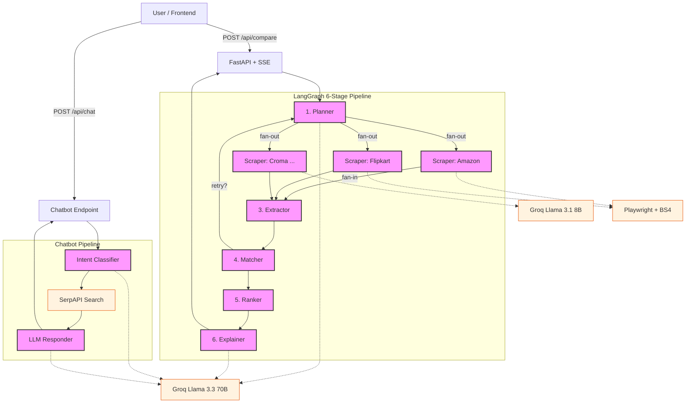

# AI-Powered E-Commerce Price Comparison Engine


An intelligent, **agentic** price comparison engine for **Indian e-commerce marketplaces**, powered by a **LangGraph** multi-agent pipeline, **Groq LLM** extraction, and **stealth Playwright** scraping.

Type a natural-language query like *"Samsung Galaxy S24 256GB"* — the system scrapes **10+ marketplaces in parallel**, extracts structured product data with AI, matches and ranks offers, and returns a comparison with an **AI-generated recommendation**.

Also includes a standalone **AI Shopping Chatbot** that fetches live prices from Google Shopping via SerpAPI.

---

## Features

### Feature 1 — Price Comparison Pipeline (LangGraph)

- **6-stage agentic pipeline** orchestrated by LangGraph `StateGraph`:
  `Planner → Scrapers (parallel) → Extractor → Matcher → Ranker → Explainer`
- **12 Indian marketplace scrapers** — Amazon, Flipkart, Croma, JioMart, Meesho, Snapdeal, Tata CLiQ, Reliance Digital, Samsung Shop, Vijay Sales, Paytm Mall, Shopsy
- **Dual scraping approaches**:
  - **Approach 1**: Playwright stealth + Groq Llama 3.1 8B extraction (most sites)
  - **Approach 2**: Playwright stealth + BeautifulSoup4 CSS parsing (Amazon, Vijay Sales)
- **LLM intelligence** — query parsing, product matching, CSS selector discovery, natural-language recommendations (Groq Llama 3.3 70B)
- **4 ranking modes** — Cheapest / Fastest Delivery / Most Reliable / Balanced
- **SSE streaming** — real-time progress events per marketplace
- **Delivery info extraction** — parsed delivery days + raw text, marketplace-specific fallbacks
- **Product image thumbnails** — extracted from product cards
- **Working product URLs** — cleaned per-site (Amazon `/dp/ASIN`, Flipkart `?pid=`), with search-URL fallback

### Feature 2 — AI Shopping Chatbot

- **3-step pipeline**: Intent Classification → SerpAPI Google Shopping → Groq LLM Response
- **4 intent types**: `product_search`, `comparison`, `recommendation`, `general`
- **Live product data** from Google Shopping India via SerpAPI
- **Product cards** with thumbnail, price, star rating, source, delivery, and working "View Deal" links
- **Conversational AI** — context-aware responses with chat history

### Frontend

- **React 18 + Vite** single-page application
- **Dark-mode UI** with glassmorphic design, CSS variables
- **Offer cards** — rank badge, platform icon, price with discount %, delivery info with truck icon, seller/rating metadata, gradient CTA button, score breakdown bars
- **Live progress tracking** — SSE events show scraping/matching/ranking stages in real-time
- **Chatbot overlay** — floating "Ask AI" button, product card grid with rank badges (gold/silver/bronze), star ratings, quick suggestion chips

---

## System Architecture



---

## Pipeline Stages

### Stage 1 — Planner (`agents/planner.py`)
Parses the natural-language query using Groq Llama 3.3 70B to extract `{brand, model, storage, RAM, color, category}`. Selects target marketplaces based on product category and brand affinity. Falls back to regex parsing if LLM rate-limited.

### Stage 2 — Scrapers (`agents/scraper.py`)
**All scrapers run in parallel** (LangGraph fan-out). Each marketplace has a dedicated scraper node:
- **Amazon, Vijay Sales** — Playwright stealth + BeautifulSoup4 (CSS selectors, no LLM needed)
- **All other sites** — `sgai_scraper.py`: Playwright stealth fetch → inject `[URL:]` and `[IMG:]` markers → Groq Llama 3.1 8B extracts structured JSON

### Stage 3 — Extractor (`agents/extractor.py`)
Normalizes raw listings into `NormalizedOffer` objects:
- Price parsing: `"₹55,999"` → `55999.0`
- Delivery parsing: `"Get it by Monday"` → `(1, 3) days`
- URL cleaning: Amazon `/dp/ASIN`, Flipkart `path?pid=`, tracking param stripping
- Fallback delivery estimates per marketplace when scraper returns nothing
- Deduplication by URL or `(platform, title)` fingerprint

### Stage 4 — Matcher (`agents/matcher.py`)
6-gate hard rejection + weighted scoring:
- Type gate (phone ≠ laptop), Brand gate, Model gate, Storage gate, Category gate, Accessory gate
- Composite match score `[0.0–1.0]`; threshold = 0.4
- Optional LLM semantic matching for uncertain scores (`llm_matcher.py`)
- Retry loop: if 0 matches and < 2 attempts → retry from Planner

### Stage 5 — Ranker (`agents/ranker.py`)
Mode-aware composite scoring:
| Mode | Price Weight | Delivery Weight | Trust Weight |
|---|---|---|---|
| Cheapest | 0.70 | 0.10 | 0.20 |
| Fastest | 0.20 | 0.60 | 0.20 |
| Reliable | 0.15 | 0.15 | 0.70 |
| Balanced | 0.40 | 0.30 | 0.30 |

Assigns badges: Best Price, Fastest Delivery, Most Trusted, Recommended.

### Stage 6 — Explainer (`agents/llm_ranker.py`)
Generates a natural-language AI recommendation via Groq Llama 3.3 70B explaining why the #1 offer is the best choice.

---

## Tech Stack

| Layer | Technology |
|---|---|
| **Frontend** | React 18, Vite 6, CSS Variables (dark mode) |
| **Backend** | Python 3.11+, FastAPI, Uvicorn (async) |
| **Pipeline** | LangGraph StateGraph with parallel fan-out/fan-in |
| **LLM** | Groq — Llama 3.3 70B Versatile + Llama 3.1 8B Instant |
| **Scraping** | Playwright (stealth anti-detection), BeautifulSoup4, lxml |
| **Chatbot** | SerpAPI Google Shopping + Groq conversational LLM |
| **Caching** | Redis (optional, 5-min TTL) |
| **Config** | YAML marketplace configs, Pydantic Settings, `.env` |
| **Dev** | Watchfiles hot-reload, Vite HMR proxy |

---

## Installation & Setup

### Prerequisites

- **Python 3.11+**
- **Node.js 18+** and npm
- **Groq API Key** — get one free at [console.groq.com/keys](https://console.groq.com/keys)
- **SerpAPI Key** *(optional, for chatbot)* — get one at [serpapi.com](https://serpapi.com/)

### 1. Clone & Setup Backend

```bash
git clone https://github.com/SiddharajShirke/Ai-Powered-e-commerce-scraper-.git
cd Ai-Powered-e-commerce-scraper-

# Create virtual environment
python -m venv .venv

# Activate it
# Linux/Mac:
source .venv/bin/activate
# Windows:
.venv\Scripts\activate

# Install Python dependencies
pip install -r requirements.txt

# Install Playwright Chromium browser
playwright install chromium
```

### 2. Configure Environment

```bash
cp .env.example .env
```

Edit `.env` and add your API keys:

```dotenv
# REQUIRED — Groq LLM (free tier available)
GROQ_API_KEY=your_groq_api_key_here

# OPTIONAL — SerpAPI for chatbot Google Shopping
SERPAPI_KEY=your_serpapi_key_here
```

### 3. Setup Frontend

```bash
cd frontend
npm install
```

### 4. Run the Application

**Terminal 1 — Backend:**
```bash
# From project root (venv activated)
python run.py
# → Server at http://127.0.0.1:8000
# → Hot-reload watches app/ for .py and .yaml changes
```

**Terminal 2 — Frontend:**
```bash
cd frontend
npm run dev
# → UI at http://localhost:5173
```

Open **http://localhost:5173** in your browser.

> **Without hot-reload:** `python run.py --no-reload`

---

## API Endpoints

| Method | Endpoint | Description |
|---|---|---|
| `GET` | `/` | Server heartbeat |
| `GET` | `/health` | System readiness + LLM connectivity |
| `GET` | `/api/marketplaces` | List all configured marketplace scrapers |
| `POST` | `/api/compare` | **Main endpoint** — triggers the 6-stage LangGraph pipeline. Returns SSE stream with real-time progress events, or JSON fallback. |
| `POST` | `/api/compare/sync` | Synchronous JSON-only version (no SSE) |
| `POST` | `/api/chat` | **Chatbot endpoint** — Intent → SerpAPI → LLM response |
| `POST` | `/api/debug/compare` | Debug mode — returns full pipeline state |

### Compare Request Body

```json
{
    "query": "Samsung Galaxy S24 128GB",
    "mode": "balanced",
    "preferences": {
        "mode": "balanced",
        "min_match_score": 0.4
    }
}
```

### Chat Request Body

```json
{
    "message": "Best phone under 20000",
    "chat_history": [
        { "role": "user", "content": "..." },
        { "role": "assistant", "content": "..." }
    ]
}
```

---

## Environment Variables

| Variable | Required | Default | Description |
|---|---|---|---|
| `GROQ_API_KEY` | **Yes** | — | Groq API key for Llama 3.3 70B / 8B |
| `SERPAPI_KEY` | No | — | SerpAPI key (enables chatbot Google Shopping) |
| `GROQ_PRIMARY_MODEL` | No | `llama-3.3-70b-versatile` | Primary LLM model |
| `GROQ_FAST_MODEL` | No | `llama-3.1-8b-instant` | Fast model (scraper extraction) |
| `LLM_ENABLED` | No | `true` | Enable/disable LLM features |
| `LLM_MAX_CONCURRENT` | No | `3` | Max concurrent Groq API calls |
| `PLAYWRIGHT_HEADLESS` | No | `True` | Run browser in headless mode |
| `DEBUG` | No | `False` | Debug mode |
| `LOG_LEVEL` | No | `INFO` | Logging level |
| `REDIS_URL` | No | — | Redis URL for response caching (5-min TTL) |
| `DATABASE_URL` | No | — | PostgreSQL URL for price history |
| `ALLOWED_ORIGINS` | No | `localhost` | CORS allowed origins |

---

## Project Structure

```
├── run.py                      # Entry point — uvicorn + hot-reload
├── requirements.txt            # Python dependencies
├── .env.example                # Environment template
├── .gitignore
│
├── app/
│   ├── main.py                 # FastAPI app, SSE/sync/chat endpoints
│   ├── config.py               # Pydantic Settings (.env loader)
│   ├── schemas.py              # All data models (NormalizedOffer, etc.)
│   ├── state.py                # LangGraph CompareState TypedDict
│   ├── graph.py                # LangGraph StateGraph wiring
│   │
│   ├── agents/                 # Pipeline stage implementations
│   │   ├── planner.py          # Stage 1: Query parsing + marketplace selection
│   │   ├── scraper.py          # Stage 2: Scraper node factory (parallel)
│   │   ├── extractor.py        # Stage 3: Normalization, URL cleaning, delivery
│   │   ├── matcher.py          # Stage 4: Product matching (6-gate + scoring)
│   │   ├── ranker.py           # Stage 5: Mode-aware ranking + badges
│   │   ├── llm_extractor.py    # LLM CSS selector discovery
│   │   ├── llm_matcher.py      # LLM semantic matching
│   │   └── llm_ranker.py       # Stage 6: AI recommendation generator
│   │
│   ├── scraping/               # Marketplace scraper implementations
│   │   ├── sgai_scraper.py     # Core: Playwright + Groq LLM extraction
│   │   ├── amazon.py           # Amazon.in (Playwright + BS4)
│   │   ├── vijay_sales.py      # Vijay Sales (Playwright + BS4)
│   │   ├── flipkart.py         # Flipkart
│   │   ├── croma.py            # Croma
│   │   ├── jiomart.py          # JioMart
│   │   ├── meesho.py           # Meesho
│   │   ├── snapdeal.py         # Snapdeal
│   │   ├── tata_cliq.py        # Tata CLiQ
│   │   ├── reliance_digital.py # Reliance Digital
│   │   ├── samsung_shop.py     # Samsung Shop
│   │   └── base.py             # Base scraper (Requests + BS4)
│   │
│   ├── marketplaces/           # Marketplace configuration
│   │   ├── registry.py         # YAML config loader + registry
│   │   └── configs/            # Per-site YAML configs (selectors, URLs)
│   │       ├── amazon.yaml
│   │       ├── flipkart.yaml
│   │       └── ... (12 sites)
│   │
│   ├── chatbot/                # AI Shopping Chatbot (Feature 2)
│   │   ├── intent.py           # Step 1: Intent classification (Groq)
│   │   ├── search.py           # Step 2: SerpAPI Google Shopping
│   │   ├── responder.py        # Step 3: LLM response generation
│   │   ├── service.py          # Orchestrator
│   │   └── schemas.py          # ChatRequest, ChatResponse, ShoppingResult
│   │
│   └── utils/
│       ├── llm_client.py       # Groq client with semaphore rate limiting
│       └── logger.py           # Centralized logging config
│
└── frontend/
    ├── package.json
    ├── vite.config.js          # Dev proxy (/api → :8000)
    └── src/
        ├── App.jsx             # Main comparison UI + OfferCard
        ├── main.jsx            # React entry
        ├── index.css           # All styles (dark theme + chatbot)
        └── components/
            └── ChatbotAssistant.jsx  # Chatbot overlay component
```

---

## Supported Marketplaces

| Marketplace | Scraping Method | Delivery Extraction |
|---|---|---|
| Amazon.in | Playwright + BS4 (CSS selectors) | CSS selectors + Prime detection |
| Flipkart | Playwright + Groq LLM 8B | LLM extraction from page text |
| Croma | Playwright + Groq LLM 8B | LLM extraction from page text |
| JioMart | Playwright + Groq LLM 8B | LLM extraction from page text |
| Reliance Digital | Playwright + Groq LLM 8B | LLM extraction from page text |
| Tata CLiQ | Playwright + Groq LLM 8B | LLM extraction from page text |
| Vijay Sales | Playwright + BS4 (CSS selectors) | CSS selectors |
| Samsung Shop | Playwright + Groq LLM 8B | LLM extraction from page text |
| Meesho | Playwright + Groq LLM 8B | LLM + fallback estimate |
| Snapdeal | Playwright + Groq LLM 8B | LLM + fallback estimate |

---

## License

MIT License — see [LICENSE](LICENSE) for details.

---

*Built to bring transparency and intelligence to consumer price discovery across India.*
