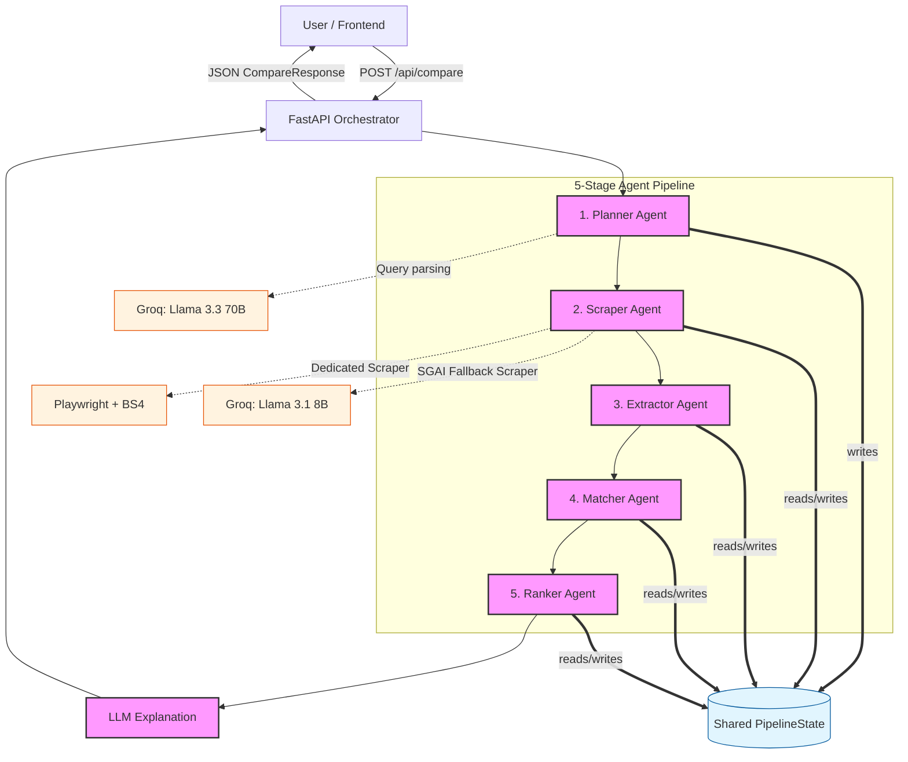
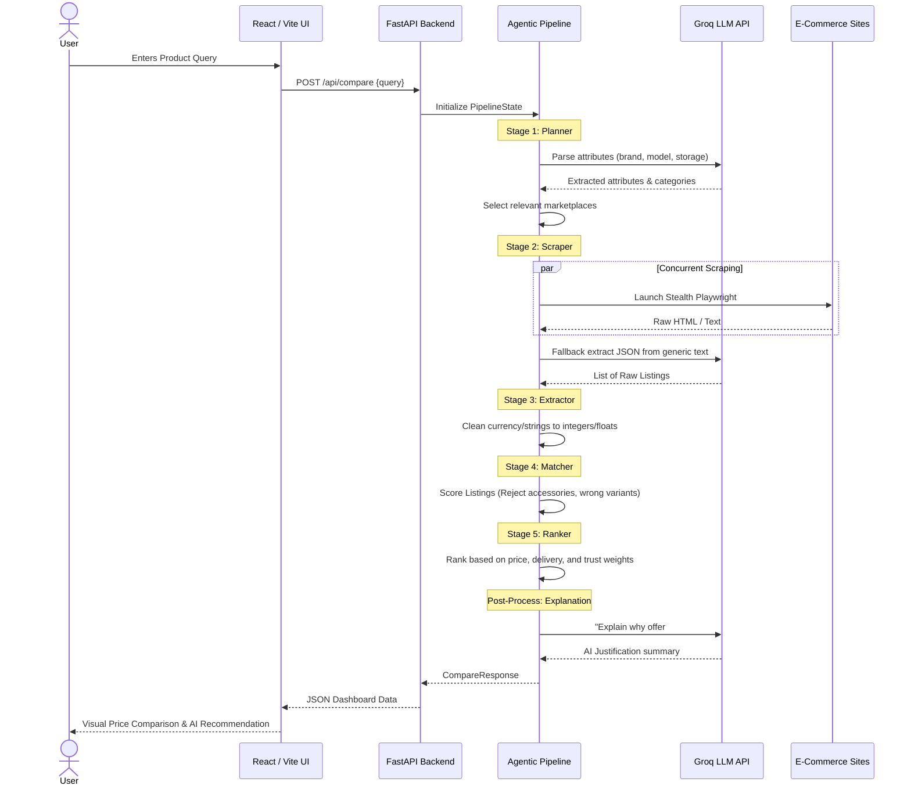

# AI-Powered E-Commerce Price Scraper Engine


An intelligent, agentic price comparison engine tailored for Indian e-commerce platforms. 

Users simply type a natural language query (e.g., *"Samsung Galaxy S24 256GB Black"*). Under the hood, the system coordinates an advanced pipeline of AI extraction agents and stealth web scrapers to gather real-time data from platforms like Amazon, Flipkart, Croma, Vijay Sales, JioMart, and Reliance Digital. The engine normalizes the data, filters out spurious accessories, ranks top offers based on multiple factors (price, delivery, trust), and returns a structured comparison along with a natural-language AI recommendation.

---

## 🏗️ System Architecture

The backend pipeline is orchestrated by a multi-agent system in `main.py`, where a shared `PipelineState` flows through 5 distinct functional stages.



---

## 🔄 User Flow Diagram



---

## ⚙️ The Pipeline — End-to-End Workflow

### Stage 1 — Planner (`planner.py`)
- **Input:** Raw query string.
- **Action:** Uses Groq (llama-3.3-70b-versatile) to extract structured fields `{brand, model, storage, ram, color, category, optimized_search_query}`.
- **Resilience:** Regex fallback activated if the LLM rate limit triggers.
- **Routing:** Dynamically selects marketplaces based on brand affinity (e.g., skips irrelevant sites).

### Stage 2 — Scraper (`scraper.py` → `sgai_scraper.py`)
- **Input:** Search query & chosen marketplaces.
- **Action:**
  - *Dedicated Sites (Amazon, Vijay Sales):* Direct HTML extraction using Playwright + BeautifulSoup. High speed, reliable CSS parsing.
  - *Generic Sites:* Launches Playwright stealth instances, extracts clean viewport body text, and pipes it to Groq (llama-3.1-8b-instant) for intelligent, generalized JSON extraction.

### Stage 3 — Extractor (`extractor.py`)
- **Input:** Text-heavy `RawListing` objects.
- **Action:** Highly aggressive Regex routines convert text strings into clean numeric structures (e.g., `"₹55,999"` → `55999.0`, `"Get it by Mon"` → `min/max delivery days`). Deals with deduplication.

### Stage 4 — Matcher (`matcher.py`)
- **Input:** Clean numerics + Intent Target.
- **Action:** Scoring engine checks variant mismatches (S23 vs S24), invalidates accessories (charging blocks, covers), and computes a confidence score `[0.0 - 1.0]`. Low scores are pruned.

### Stage 5 — Ranker (`ranker.py`)
- **Input:** Verified matched offers.
- **Action:** Adjusts rankings based on the user's focus (cheapest vs. fastest vs. most reliable). Injects aesthetic UI badges ("Best Price", "Most Trusted"). The `#1` ranked offer triggers the LLM explanation generator.

---

## 🚀 Tech Stack

- **Frontend:** React.js, Vite, TailwindCSS (Responsive, Glassmorphic UI)
- **Backend Core:** Python 3.11+, FastAPI (Async Orchestration)
- **Scraping Engine:** Playwright (Stealth Plugins), BeautifulSoup4
- **AI/LLM Layer:** Groq APIs, featuring Llama 3 70B (Deep extraction) and Llama 3 8B (Fast parsing).
- **Concurrency:** `asyncio`, Semaphore-based LLM rate limiting.

---

## 💻 Installation & Setup

### 1. Pre-requisites
- Python 3.11+
- Node.js v18+
- Go to [Groq Console](https://console.groq.com/keys) to generate your API key.

### 2. Backend Setup
```bash
# Clone the repository
git clone https://github.com/SiddharajShirke/Ai-Powered-e-commerce-scraper-.git
cd Ai-Powered-e-commerce-scraper-

# Create virtual environment
python -m venv .venv
source .venv/bin/activate  # On Windows: .venv\Scripts\activate

# Install requirements
pip install -r requirements.txt

# Install stealth browsers
playwright install
playwright install-deps

# Set up environment variables
cp .env.example .env
nano .env  # Add your GROQ_API_KEY
```

### 3. Frontend Setup
```bash
cd frontend
npm install
npm run dev
```

### 4. Running the Complete System
Start the FastAPI server:
```bash
# In the root project directory (ensure venv is active)
uvicorn app.main:app --reload --port 8000
```
Open `http://localhost:5173` in your browser.

---

## 📡 Essential API Routes

- **`GET /`**: Server Heartbeat.
- **`GET /health`**: LLM connectivity status & system readiness.
- **`GET /api/marketplaces`**: Available vendor scraping modules.
- **`POST /api/compare`**: The main orchestration endpoint. Triggers the 5-stage pipeline and returns the full `CompareResponse`. 
- **`POST /api/debug/compare`**: Similar to above but dumps the `PipelineState` step by step for telemetry.

---
*Built to bring total transparency and speed to consumer price discovery.*
